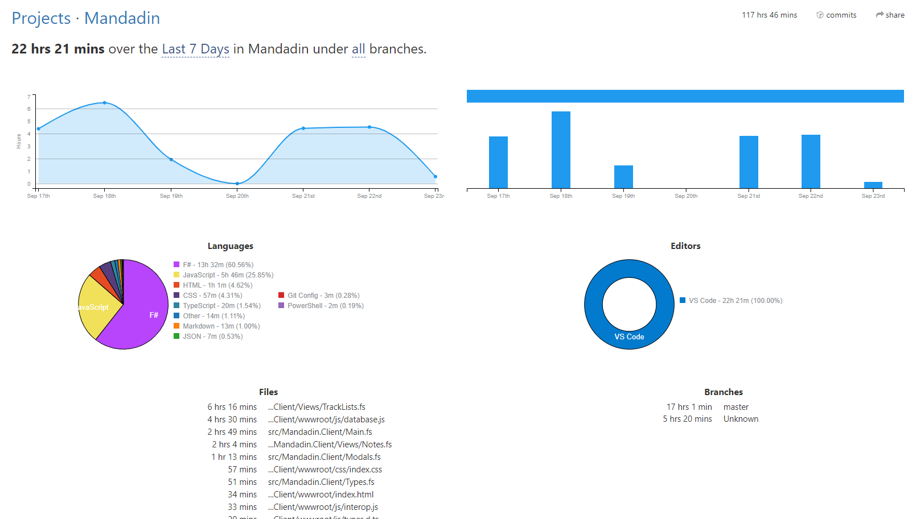

# Mandadin 4

The 4th version because how else I'm I ever going to learn languages and stacks...

Mandadi 4 is a simple note-taking/grocery shopping app with a lot of UX and UI issues most of the time I write a new version of this project is to test a tech stack or to practice a particular skill. some of the particular features this Mandadin has are

- Webassembly (Written in F#)
- Web Share API
- Clipboard API
- Javascript Interop
- PWA
- Offline
- MVU architecture
- Component as pages
- "Reusable" components (Modals)
- Hosted on Firebase

So... yup! it is a simple concept with some complex things under the hood

if you are feeling curious, go to check it out! https://mandadin-4.web.app/ it's a PWA so if you visit on your Phone it will likely will prompt you to add it to your home screen

# Review
So that's cool but why would I use Bolero in the first place?

There are some reasons you may want to do that, the first one is Correctness the joy of using F# will give you correct programs most of the time, from the 4 versions I've done of this this is the first one I haven't spent more time fixing bugs than working on the implementation.

Dev time, according to my wakatime stats I spent about 22hrs to get the MVP out during 7 days given the fact that this is the 4th time I write this and I already know what I need to know about the app, it is still fastest one I've ever done

it feels really good working with F# and Bolero I don't have any complains at all when it comes to Bolero

## why wouldn't I want to work with Bolero then?
I don't think you don't want to work with Bolero, it's more about webassembly itself even if its Rust, C++, C, C# you name the flavor.
As you can see within [src\Mandadin.Client\wwwroot\js](src\Mandadin.Client\wwwroot\js) there is javascript, so one of the advantages of F# is that you don't have to deal with the extreme flexibility of javascript which can be a good and a bad thing, the interop bits will be the main source of bugs you will have and if you are into a more serious project that must interop with JS libraries chances are that your js folder will grow bigger and bigger which will require at some point that you actually either bundle/minimize/uglify your code and if you are already defining a toolchain for that do you even want to start with webassembly at all? you should be better using a JS/TS project from the beginning and benefit from its wonderful tooling.

As I said, I don't have complains about Bolero, it's more about webassembly in general, but if you can afford to go 100% vanilla F# (no js dependencies) be my guest and enjoy the benefits of using Bolero and F#